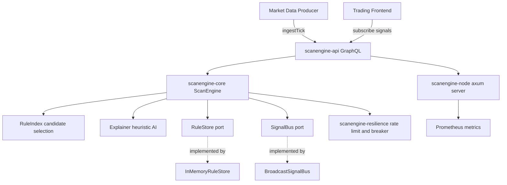
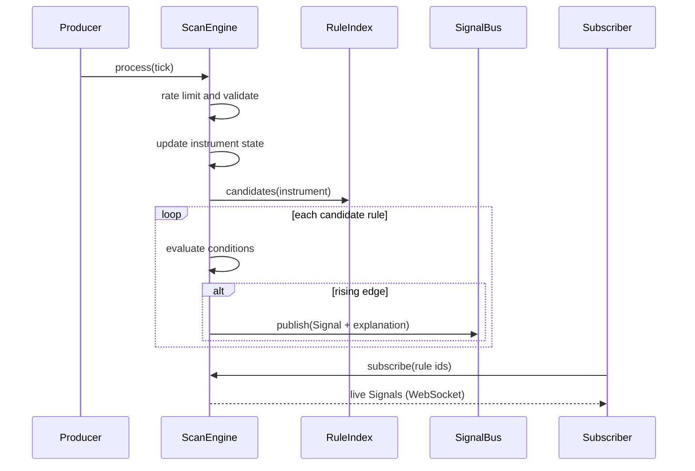

# ScanEngine

> A production-grade, deterministic **complex-event-processing (CEP) scanner** in Rust —
> evaluates **thousands of live rules per tick** against a streaming market feed, emits
> rising-edge signals with heuristic explanations, over GraphQL + WebSocket.

[](https://www.rust-lang.org)
[](https://doc.rust-lang.org/edition-guide/)
[](#license)
[](#test-results)
[](#test-results)
[](#safety)

---

## Table of Contents

- [Overview](#overview)
- [Why This Exists](#why-this-exists)
- [Architecture](#architecture)
- [Data Flow](#data-flow)
- [Crate Layout](#crate-layout)
- [Getting Started](#getting-started)
- [GraphQL API](#graphql-api)
- [Rule Model](#rule-model)
- [Resilience](#resilience)
- [Observability](#observability)
- [Benchmarks and Complexity](#benchmarks-and-complexity)
- [Test Results](#test-results)
- [Configuration](#configuration)
- [Docker and Monitoring](#docker-and-monitoring)
- [Safety](#safety)
- [License](#license)

---

## Overview

ScanEngine ingests validated market **ticks**, maintains per-instrument
**state** (open, last, high, low, volume, percentage change), and evaluates a
live base of **rules** against every update. A rule is an AND of typed
**conditions** (field, comparator, threshold). When a rule transitions from
not-matching to matching — a **rising edge** — the engine emits a **signal**
with a deterministic, heuristic natural-language explanation. Firing state is
tracked per `(rule, instrument)` so a rule that stays true does not spam
duplicate signals.

Key properties:

- **Deterministic** — same tick stream and rule set always produce the same
  signals; no wall-clock or RNG in the hot path.
- **Incremental** — a `RuleIndex` narrows evaluation to candidate rules
  (instrument-scoped plus any-scoped) instead of a full scan when possible.
- **Rising-edge semantics** — signal on transition, with `CrossAbove` /
  `CrossBelow` comparators for level crossings.
- **Explainable** — every signal carries a heuristic explanation (guideline 12).
- **GraphQL + WebSocket** — queries, mutations, and a live subscription.

## Why This Exists

Trading scanners must watch thousands of user-defined conditions across a large
instrument universe and alert the instant a condition flips true. ScanEngine is
that rules engine: fast, deterministic, observable, and resilient by
construction, with a clean port boundary so rule storage and signal transport
can be swapped without touching the core.

## Architecture

Hexagonal (ports-and-adapters). Dependencies point **inward**; the domain core
never imports a web or database framework.



## Data Flow



## Crate Layout

| Crate | Responsibility | Depends on |
|-------|----------------|------------|
| `scanengine-types` | Domain types: `MarketTick`, `InstrumentState`, `Rule`, `Condition`, `Signal`, newtypes | — |
| `scanengine-resilience` | Timeout, retry, circuit breaker, rate limiter, bulkhead | — |
| `scanengine-core` | `ScanEngine`, `RuleIndex`, `Explainer`, ports (`RuleStore`, `SignalBus`) | types, resilience |
| `scanengine-infra` | `InMemoryRuleStore`, `BroadcastSignalBus`, deterministic `TickGenerator` | types, core |
| `scanengine-api` | async-graphql schema: queries, mutations, subscription | types, core, infra |
| `scanengine-node` | axum server, CLI, telemetry, load test, benches | all |

## Getting Started

```bash
# Build and test everything
cargo test --workspace

# Run the server (GraphQL playground at http://localhost:8081/graphql)
cargo run --release -- serve --addr 0.0.0.0:8081

# Run the in-process load test
cargo run --release -- load --instruments 2000 --rules 1000 --ticks 1000000
```

## GraphQL API

Seven root operations (well past the threshold where GraphQL beats REST):

| Type | Field | Purpose |
|------|-------|---------|
| Query | `rules` | All registered rules |
| Query | `state(instrument)` | Current state for one instrument |
| Query | `stats` | Engine statistics |
| Mutation | `addRule(input)` | Register a scanner rule; returns its id |
| Mutation | `removeRule(id)` | Remove a rule by id |
| Mutation | `ingestTick(input)` | Publish a tick; returns signals fired by it |
| Subscription | `signals(ruleIds)` | Live signal stream, optionally filtered (WebSocket) |

Example — register a rule and fire it:

```graphql
mutation {
  addRule(input: {
    name: "breakout-above-100",
    conditions: [{ field: LAST_PRICE, comparator: CROSS_ABOVE, threshold: 100 }]
  })
}

mutation {
  ingestTick(input: { instrument: "NSE:TCS", lastPrice: 150, volume: 2 }) {
    ruleName instrument lastPrice pctChangeBps explanation
  }
}
```

Example subscription:

```graphql
subscription {
  signals(ruleIds: []) { ruleName instrument lastPrice explanation triggeredAt }
}
```

## Rule Model

A **rule** = name + scope (`Any` or a single instrument) + a conjunction of
**conditions**. A **condition** = `field · comparator · threshold`.

| Field | Meaning |
|-------|---------|
| `LAST_PRICE` | Last traded price |
| `HIGH` / `LOW` | Session high / low |
| `VOLUME` | Cumulative volume |
| `PCT_CHANGE_BPS` | Percentage change from open, in basis points |

| Comparator | Semantics |
|------------|-----------|
| `GT` / `GTE` / `LT` / `LTE` | Level comparison on the current value |
| `CROSS_ABOVE` | Rising edge: previous < threshold and current ≥ threshold |
| `CROSS_BELOW` | Falling edge: previous > threshold and current ≤ threshold |

Cross comparators use the previous observed value, making the engine stateful
and edge-triggered rather than level-triggered.

## Resilience

The `scanengine-resilience` crate provides composable, clock-injectable primitives:

- **Rate limiter** (token bucket) guards tick admission.
- **Circuit breaker** (Closed/Open/HalfOpen) for downstream calls.
- **Retry** with equal-jitter backoff (no `rand` dependency — deterministic).
- **Bulkhead** (semaphore) bounds concurrency.
- **Timeout** wrapper for any future.

All are unit-tested with a `ManualClock` so no test sleeps.

## Observability

- **Structured tracing** (JSON) via `tracing` + `tracing-subscriber`.
- **Prometheus metrics** at `/metrics`:
  `scanengine_ticks_processed_total`, `scanengine_signals_emitted_total`,
  `scanengine_rate_limited_total`.
- **Health probes**: `/health/live`, `/health/ready`.

## Benchmarks and Complexity

Measured on the in-process load test (release build, 2000 instruments, 1000
any-scoped rules, 2 conditions each — every tick evaluates the full rule base):

| Scenario | Tick throughput | Condition evals/sec | Evals/tick | p50 (per tick) | p99 | p99.9 |
|----------|-----------------|---------------------|-----------|----------------|-----|-------|
| 1000 rules × 2000 conditions | **18.0K ticks/sec** | **36.0M evals/sec** | 2000 | 49.7 µs | 127 µs | 342 µs |

That is roughly **25 ns per condition evaluation** sustained, with ~2M
rising-edge signals emitted over 1M ticks.

Complexity of the hot paths:

| Operation | Time | Space | Notes |
|-----------|------|-------|-------|
| `ScanEngine::process` | O(c) | O(1) | c = candidate conditions for the tick |
| `RuleIndex::candidates` | O(1) avg | O(r) | instrument bucket + any-scoped vector |
| `Rule::matches` | O(k) | O(1) | k = conditions in the rule (short-circuits) |
| `Condition::evaluate` | O(1) | O(1) | integer comparison / edge check |
| `InMemoryRuleStore::get` | O(1) avg | O(1) | sharded map |

Run the criterion micro-benchmark:

```bash
cargo bench -p scanengine-node
```

## Test Results

```text
scanengine-types        10 passed
scanengine-resilience   10 passed
scanengine-core          7 passed
scanengine-infra         4 passed
scanengine-api           2 passed
scanengine-node          3 passed
-------------------------------------
total                   36 passed, 0 failed
```

Coverage spans unit tests (newtypes, condition/rule evaluation, breaker/limiter
with a manual clock, rule index, explainer), engine tests against `mockall`
port mocks, an end-to-end GraphQL execute test, and axum handler tests via
`tower::ServiceExt::oneshot`.

## Configuration

| Flag / Env | Default | Meaning |
|------------|---------|---------|
| `--addr` / `SCANENGINE_ADDR` | `0.0.0.0:8081` | Bind address |
| `--max-instruments` / `SCANENGINE_MAX_INSTRUMENTS` | `100000` | Instrument cap |

Load-test flags: `--instruments`, `--rules`, `--ticks`.

## Docker and Monitoring

```bash
# Build and run with Prometheus + Grafana
docker compose --profile monitoring up --build
```

- App: `http://localhost:8081/graphql`
- Metrics: `http://localhost:8081/metrics`
- Prometheus: `http://localhost:9090`

## Safety

Every crate declares `#![forbid(unsafe_code)]` (via `[lints.rust] unsafe_code = "forbid"`).
There is no `unsafe` in this workspace.

## License

MIT — see [LICENSE](LICENSE).
